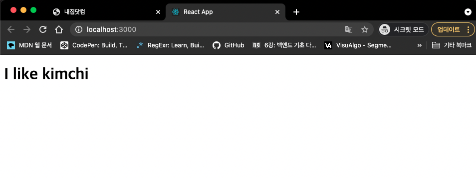
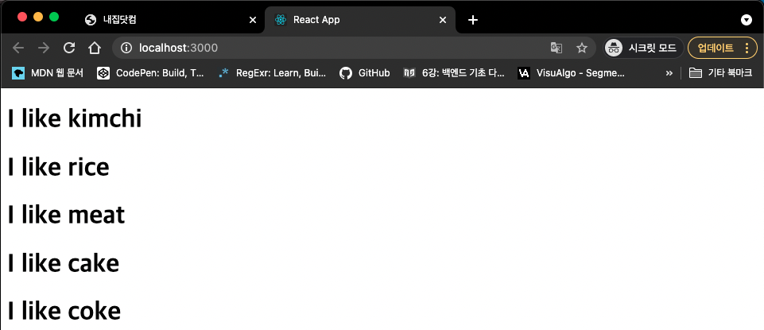
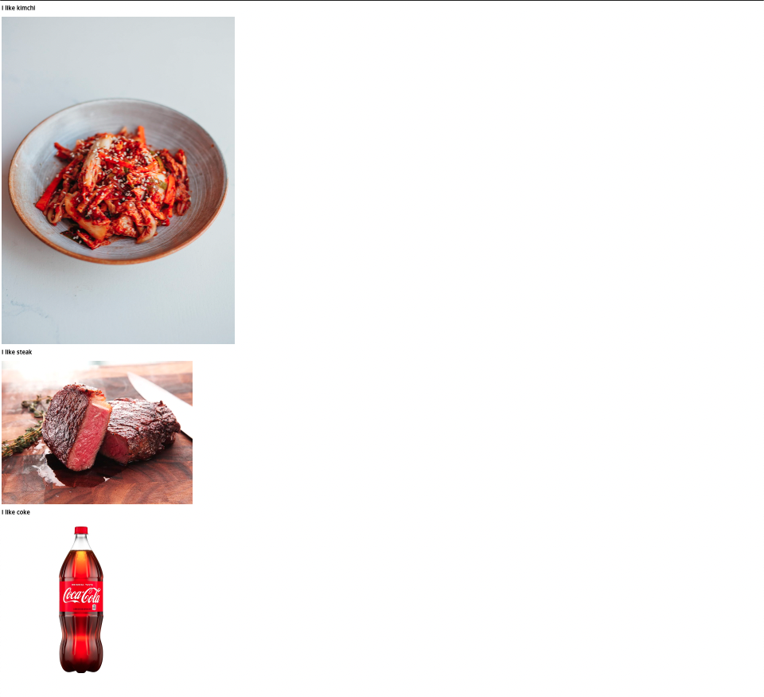
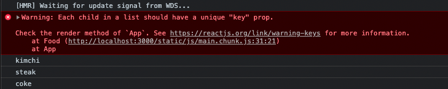
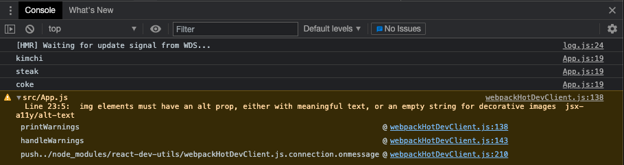
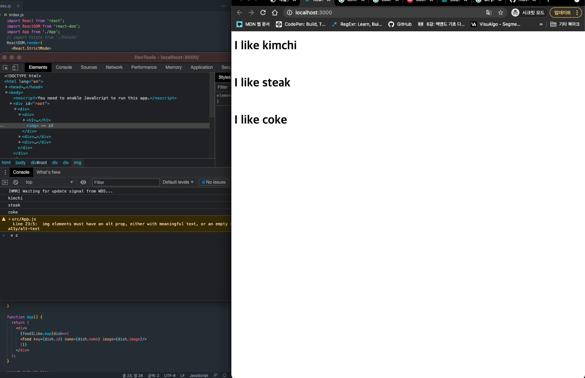
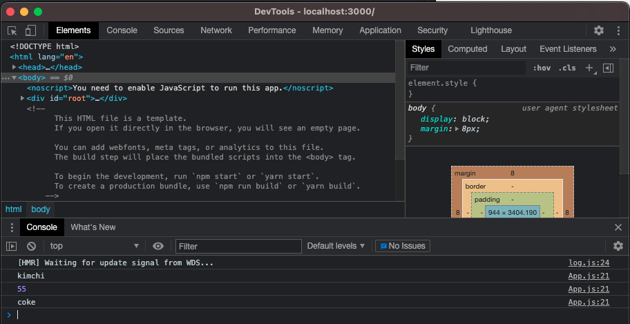
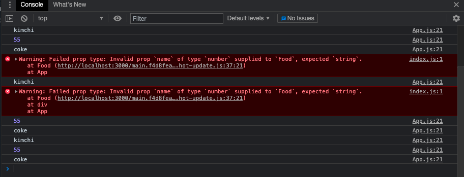
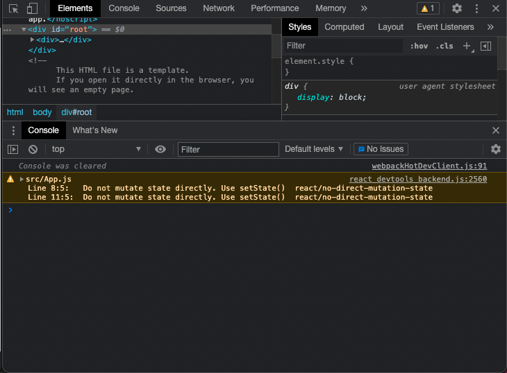
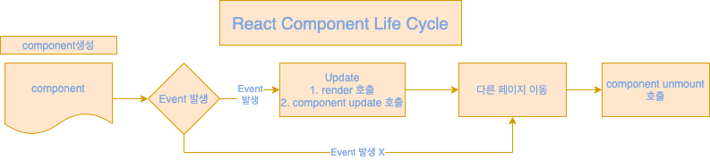

# React Lecture _ nomad coder's movie app

## 1. SETUP

### 1.0. Creating your first React App

react 를 설치하려면 `node.js 10.16 이상, npm 5.6` 이상의 버전이 설치 되어 있어야 한다.

1. react 설치 명령어

```
npx create-react-app `{폴더 이름}`
```

2. react 실행 명령어

react 가 설치된 디렉토리로 진입한 뒤 아래 명령어 실행.

```
npm start
yarn start
```


### 1.2. How does React Work?

기본적으로 public 파일에 존재하는 html 에 src 폴더 안에 존재하는 컴포넌트들을 삽입하는 형태이다.

---

## 2 JSX & PROPS

### 2.0 Creating your first React Component

1. Component 란

Component 란 html 을 반환해주는 함수이다. 즉 js 로 html 을 반환하게 되는데 이러한 특수한 상황에서 쓰는 것이 jsx 이다.
jsx 는 js 와 html 이 혼재하는 듯한 특이한 모습을 가진다


```javascript
function App() {
  return (
    <div> hello! </div>
  );
}

export default App;
```

2. 새로운 Component 만들기

src 폴더안에 potato.js 라는 폴더를 만든다.

**[/src/potato.js]**

```javascript
import  React  from "react";

function Potato(){
    return <h3>I love Potato</h3>
}

export default Potato;
```

**주의 !** : 만들어진 potato 라는 컴포넌트를 아래와 같이 쓰면 안된다.


**[/src/index.js]**

```javascript
import React from 'react';
import ReactDOM from 'react-dom';
import App from './App';
import Potato from './potato'
ReactDOM.render(
  <React.StrictMode>
    <App />
    <Potato />
  </React.StrictMode>,
  document.getElementById('root')
);
```

react Application 은 하나의 Component 만은 rendering 한다. 그 default 는 App 이다. 위와 같이 <App /> 과 <Potato /> 가 동시에 사용되면 에러를 뱉게 된다. 따라서 아래와 같은 방식을 취해야 한다.

**[/src/App.js]**

```javascript
import Potato from './Potato';

function App() {
  return (
    <div>
      <Potato/>
    </div>
  );
}

export default App;

```

또한 위에서처럼 파일을 분리하지 않고 아래와 같이 사용해도 동작한다.

```javascript
function Potato() {
  return (
    <h1>I like potato</h1>
  )
}

function App() {
  return (
    <div>
      <Potato/>
    </div>
  );
}

export default App;
```

### 2.1 Reusable Components with JSX + Props

```javascript
function Food(props) {
  console.log(props);
  return (
    <h1>I like potato</h1>
  )
}

function App() {
  return (
    <div>
      <Food
      fav = "kimchi"
      something = {true}
      test33 = {["hello", 1,2,3,4,true]}/>
    </div>
  );
}

export default App;
```

위의 소스에서 콘솔에는 아래와 같은 정보가 찍힌다

```JSON
{
    "fav": "kimchi",
    "something": true,
    "test33": [
        "hello",
        1,
        2,
        3,
        4,
        true
    ]
}
```

react 에서는 html 에서의 속성을 사용하는 것처럼 Property 를 사용해서 그 정보를 다른 곳으로 넘기는 게 가능하다.</br>
위의 소스에서는 Food 라는 Component 에서 fav, something, test33 이라는 props 를 Food 라는 함수에 넘겨서 그 결과를 출력 해 봤다.</br>
위의 소스에서 props 는 객체이므로 아래와 같이 접근이 가능하다.

```javascript
function Food(props) {
  console.log(props.fav);
  return (
    <h1>I like potato</h1>
  )
}

function App() {
  return (
    <div>
      <Food
      fav = "kimchi"
      something = {true}
      test33 = {["hello", 1,2,3,4,true]}/>
    </div>
  );
}

export default App;
```

위의 소스에서 콘솔에는 kimchi 가 찍히게 된다. 추가로 ES6 에서는 아래와 같은 문법도 적용 가능하다.

```javascript
function Food({fav}) {
  console.log(fav);
  return (
    <h1>I like {fav}</h1>
  )
}

function App() {
  return (
    <div>
      <Food
      fav = "kimchi"
      something = {true}
      test33 = {["hello", 1,2,3,4,true]}/>
    </div>
  );
}

export default App;
```
위 코드에 대한 결과값이 아래의 사진과 같다.



즉 다른 props 를 매개변수로 전달하여 다른 Jsx 에 적용이 가능하게 된다. 이러한 강점은 하나의 컴포넌트를 props 에 따라 간편하게 수정이 가능하다는 것이다.

```javascript
function Food({fav}) {
  console.log({fav});
  return (
    <h1>I like {fav}</h1>
  )
}

function App() {
  return (
    <div>
      <Food fav = "kimchi" />
      <Food fav = "rice" />
      <Food fav = "meat" />
      <Food fav = "cake" />
      <Food fav = "coke" />
    </div>
  );
}

export default App;
```




### 2.2 Dynamic Component Generation

```javascript
function Food({fav}) {
  console.log({fav});
  return (
    <h1>I like {fav}</h1>
  )
}

function App() {
  return (
    <div>
      <Food fav = "kimchi" />
      <Food fav = "rice" />
      <Food fav = "meat" />
      <Food fav = "cake" />
      <Food fav = "coke" />
    </div>
  );
}

export default App;
```

위의 코드에서 Food 라는 컴포넌트를 사용할 때 그 개수가 많아지면 매번 복붙을 해야 하는 번거로움이 있다. REST API 를 사용한다고 가정할 때 서버에서 던져주는 자료들이 동적일 경우가 있는데 이 때마다 맞춰서 복붙을 하는 것은 불가능하다. 따라서 props 를 사용하여 서버가 던져주는 자료들을 동적으로 처리할 수 있게 만들 수 있다.

```javascript
const foodILike = [
  {
    name: 'kimchi',
    image: 'https://www.wearesovegan.com/wp-content/uploads/2020/09/howtomakevegankimchirecipe-h1-1170x1645.jpg'
  },
  {
    name: 'steak',
    image: 'https://www.seriouseats.com/thmb/EZaQnk1yjGYVIkASseEWqtFRHyc=/960x0/filters:no_upscale():max_bytes(150000):strip_icc():format(webp)/__opt__aboutcom__coeus__resources__content_migration__serious_eats__seriouseats.com__recipes__images__2015__05__Anova-Steak-Guide-Sous-Vide-Photos15-beauty-159b7038c56a4e7685b57f478ca3e4c8.jpg'
  },
  {
    name: 'coke',
    image: 'https://images.heb.com/is/image/HEBGrocery/001397056?fit=constrain,1&wid=800&hei=800&fmt=jpg&qlt=85,0&resMode=sharp2&op_usm=1.75,0.3,2,0'
  },
]
```

서버가 던져주는 데이터가 위와 같다고 가정해 보자. 우리는 이러한 자료를 어떻게 우리가 만든 Component 에 적용할 수 있는 지 알아보자</br>

```javascript
const foodILike = [
  {
    name: 'kimchi',
    image: 'https://www.wearesovegan.com/wp-content/uploads/2020/09/howtomakevegankimchirecipe-h1-1170x1645.jpg'
  },
  {
    name: 'steak',
    image: 'https://www.seriouseats.com/thmb/EZaQnk1yjGYVIkASseEWqtFRHyc=/960x0/filters:no_upscale():max_bytes(150000):strip_icc():format(webp)/__opt__aboutcom__coeus__resources__content_migration__serious_eats__seriouseats.com__recipes__images__2015__05__Anova-Steak-Guide-Sous-Vide-Photos15-beauty-159b7038c56a4e7685b57f478ca3e4c8.jpg'
  },
  {
    name: 'coke',
    image: 'https://images.heb.com/is/image/HEBGrocery/001397056?fit=constrain,1&wid=800&hei=800&fmt=jpg&qlt=85,0&resMode=sharp2&op_usm=1.75,0.3,2,0'
  },
]

function Food(props) {
  console.log(props.name);
  return (
    <div>
    <h1>I like {props.name}</h1>
    </img>
    </div>
  )
}

function App() {
  return (
    <div>
      {foodILike.map(dish=>(
      <Food name={dish.name} image={dish.image}/>
      ))}
    </div>
  );
}

export default App;
```

위의 소스에서 map 에 의해 배열 안을 순회하면서 `<Food>` 태그를 return 하게 된다. `<Food>` 태그에 `name`, `image` 라는 props 를 각각 부여했고 위의 `Food` Component(함수) 에서 이를 각각 `h1`, `img` 태그에 부여했다. 이에 따라 위의 소스는 아래와 같은 결과를 가진다.



### 2.3 map Recap

map 함수의 기본 사용 형태는 아래와 같다.</br>

`arr.map(callback(currentValue[, index[, array]])[, thisArg])`

위의 형태에서 callback 은 콜백**함수** 를 의미하며 이는 사용자화 할 수 있다. 즉 아래의 소스와 같은 형태를 쓸 수 있다.

```javascript
function Food(props) {
  console.log(props.name);
  return (
    <div>
    <h1>I like {props.name}</h1>
    </img>
    </div>
  )
}

function renderFood(dish) {
  console.log(dish);
  return <Food name={dish.name} image={dish.image}/>
}

function App() {
  return (
    <div>
      {foodILike.map(renderFood)}
    </div>
  );
}
```

* react 의 Component 를 사용하다보면 아래와 같은 에러가 뜨는 경우가 았다.



이는 React 의 Component 들은 uniqueness 즉 독립성을 보장받아야 하기 때문이다. 사람의 관점에서는 위의 `<Food>` Component 는 name, image 속성이 다르지만 React 는 이를 인지하지 못한다. 따라서 unique 한 값을 부여해서 각각의 `<Food>` Component 들이 다름을 react 에게 인지시켜줘야 한다.

```javascript
const foodILike = [
  {
    id: 1,
    name: 'kimchi',
    image: 'https://www.wearesovegan.com/wp-content/uploads/2020/09/howtomakevegankimchirecipe-h1-1170x1645.jpg'
  },
  {
    id: 2,
    name: 'steak',
    image: 'https://www.seriouseats.com/thmb/EZaQnk1yjGYVIkASseEWqtFRHyc=/960x0/filters:no_upscale():max_bytes(150000):strip_icc():format(webp)/__opt__aboutcom__coeus__resources__content_migration__serious_eats__seriouseats.com__recipes__images__2015__05__Anova-Steak-Guide-Sous-Vide-Photos15-beauty-159b7038c56a4e7685b57f478ca3e4c8.jpg'
  },
  {
    id: 3,
    name: 'coke',
    image: 'https://images.heb.com/is/image/HEBGrocery/001397056?fit=constrain,1&wid=800&hei=800&fmt=jpg&qlt=85,0&resMode=sharp2&op_usm=1.75,0.3,2,0'
  }
]

function App() {
  return (
    <div>
      {foodILike.map(dish=>(
      <Food key={dish.id} name={dish.name} image={dish.image}/>
      ))}
    </div>
  );
}
```

위와 같이 Food 컴포넌트에 key 라는 props 를 부여해서 독립성을 보장해 주었다. 이 key 라는 props 는 프로그래머가 사용하는 것이 아니라 위에서 설명했듯이 react 가 혼동하지 않게 해 주려고 써준것이다.</br>

또한 react 를 사용하다 보면 아래와 같은 오류메시지도 볼 수 있다.



이는 img 태그의 속성에 alt 를 부여하지 않아서 발생하는 오류이다. alt 속성은 시각장애인을 위한 속성으로 왠만하면 이를 적어주는 것이 좋다.


### 2.4 Protection with PropTypes

만약에 props 의 이름이 잘못되거나 우리가 원하는 형태가 아니라면 react 는 그 오류를 찾을 줄 수 없다.

```javascript
function Food(props) {
  console.log(props.name);
  return (
    <div>
    <h1>I like {props.name}</h1>
    </img>
    </div>
  )
}

function App() {
  return (
    <div>
      {foodILike.map(dish=>(
      <Food key={dish.id} name={dish.name} image={dish.image}/>
      ))}
    </div>
  );
}
```

위와 같은 소스에서 Food 의 props 로 image 를 선언했는데 Food 함수는 정작 image 가 아닌 picture 를 사용하고 있다. 아래 그림과 같이 react 자체는 아무 문제 없이 동작한다.



이러한 문제를 해결하기 위해서는 prop-types 가 필요하다.

```
npm i prop-types -s
```

만약 서버에서 받아오는 정보가 우리가 생각하는 props 랑 다른 경우를 상정해보자.

```javascript
const foodILike = [
  {
    id: 1,
    name: 'kimchi',
    image: 'https://www.wearesovegan.com/wp-content/uploads/2020/09/howtomakevegankimchirecipe-h1-1170x1645.jpg'
  },
  {
    id: 2,
    name: 55,
    image: 'https://www.seriouseats.com/thmb/EZaQnk1yjGYVIkASseEWqtFRHyc=/960x0/filters:no_upscale():max_bytes(150000):strip_icc():format(webp)/__opt__aboutcom__coeus__resources__content_migration__serious_eats__seriouseats.com__recipes__images__2015__05__Anova-Steak-Guide-Sous-Vide-Photos15-beauty-159b7038c56a4e7685b57f478ca3e4c8.jpg'
  },
  {
    id: 3,
    name: 'coke',
    image: 'https://images.heb.com/is/image/HEBGrocery/001397056?fit=constrain,1&wid=800&hei=800&fmt=jpg&qlt=85,0&resMode=sharp2&op_usm=1.75,0.3,2,0'
  }
]
function Food(props) {
  console.log(props.name);
  return (
    <div>
    <h1>I like {props.name}</h1>
    </img>
    </div>
  )
}
```

위의 소스에서 서버에서 받아오는 데이터중 name 에 해당하는 필드는 반드시 string 이여야 한다면 기존의 react 는 아래와 같이 아무런 오류를 잡아주지 못한다.



하지만 prop-types 를 아래와 같이 사용하면 오류를 뱉어준다.

```javascript
import { PropTypes } from "prop-types";

const foodILike = [
  {
    id: 1,
    name: 'kimchi',
    image: 'https://www.wearesovegan.com/wp-content/uploads/2020/09/howtomakevegankimchirecipe-h1-1170x1645.jpg'
  },
  {
    id: 2,
    name: 55,
    image: 'https://www.seriouseats.com/thmb/EZaQnk1yjGYVIkASseEWqtFRHyc=/960x0/filters:no_upscale():max_bytes(150000):strip_icc():format(webp)/__opt__aboutcom__coeus__resources__content_migration__serious_eats__seriouseats.com__recipes__images__2015__05__Anova-Steak-Guide-Sous-Vide-Photos15-beauty-159b7038c56a4e7685b57f478ca3e4c8.jpg'
  },
  {
    id: 3,
    name: 'coke',
    image: 'https://images.heb.com/is/image/HEBGrocery/001397056?fit=constrain,1&wid=800&hei=800&fmt=jpg&qlt=85,0&resMode=sharp2&op_usm=1.75,0.3,2,0'
  }
]
function Food(props) {
  console.log(props.name);
  return (
    <div>
    <h1>I like {props.name}</h1>
    </img>
    </div>
  )
}

Food.propTypes = {
  name: PropTypes.string.isRequired,   //name 은 반드시 string 이여야 한다.
  image: PropTypes.string.isRequired,  //image 는 반드시 string 이여야 한다.
}
```



## 3. STATE

이제까지 살펴봤던 Component 들은 함수형 Component 였다. state 를 배우기 앞서 Class Component 를 배워보자.

### 3.0 Class Components and State (10:11)

react Class Component 의 기본 구성은 아래와 같다

```javascript
import React from "react";

class App extends React.Component{ // 1.
  state = {
    count: 0
  };
  add = ()=>{
    console.log("add");
  }
  minus = ()=>{
    console.log("minus");
  }
    render() { // 2.
    return <div>
      <h1>The number is : {this.state.count}</h1> // 3.
      <button onClick={this.add}>Add</button> // 4.
      <button onClick={this.minus}>Minus</button>
    </div>
  }
}

export default App;
```

1. class App extends React.Component 의 의미
React.Component 라는 부모에게 App 이라는 자식이 그 속성을 상속 받았다는 뜻.
2. functional Component 와는 다른 점
functional Component 와는 달리 class 는 함수가 아니므로 return 이 존재하지 않으며 render 라는 함수를 사용해야 한다.
3. class 형 Component 를 사용하는 이유
state 를 사용하기 위함인데 위의 소스와 같이 state 도 기본적으로 객체이므로 위와 같이 접근하면 된다.
4. button onClick
여기서는 주의점인데 이벤트 사용시 아래를 주의해야 한다.
* 기본 html onclick 과 달리 react onClick은 [헝가리안 표기법](https://namu.wiki/w/%ED%97%9D%EA%B0%80%EB%A6%AC%EC%95%88%20%ED%91%9C%EA%B8%B0%EB%B2%95)을 따른다 --> onclick(x) onClick(o)
* 기본적으로 이벤트는 함수선언식으로 해야 한다.
```javascript
<button onClick={this.add}>Add</button> // (O)
<button onClick={this.add()}>Add</button> // (X)
```
(조금만 생각해 보면 당연한 것. render 가 실행되면서 만약 this.add() 를 만나면 바로 실행 됨. 우리가 원하는 것은 클릭이 되었을 때 실행이 되야 하는 것이다. 따라서 onClick 이라는 곳에 함수를 할당하는 것으로 생각해야 한다.)

### 3.1 All you need to know about State (07:55)

이제 state 를 사용하는 방법을 알아보자.

```javascript
import React from "react";

class App extends React.Component{
  state = {
    count: 0
  };
  add = ()=>{
    this.setState({ state: state+1 });
  }
  minus = ()=>{
    this.setState({ state: state-1 });
  }
    render() { // react 는 자동으로 이 render method 를 실행하려 함
    return <div>
      <h1>The number is : {this.state.count}</h1>
      <button onClick={this.add}>Add</button>
      <button onClick={this.minus}>Minus</button>
    </div>
  }
}

export default App;
```

우리가 원하는 것은 add 라는 버튼을 눌렀을 때 1이 올라가고 Minus 를 눌렀을 때 1이 내려가는 것을 원한다. 하지만 위의 소스를 실행하면 정상동작하지 않고 아래의 경고 메시지를 준다.



이는 react 는 state 의 직접접근을 허용하지 않기 때문이다. 따러서 **setState** 라는 메소드를 사용해야 한다.

```javascript
import React from "react";

class App extends React.Component{
  state = {
    count: 0
  };
  add = ()=>{
    this.setState({ count: this.state.count + 1 })
  }
  minus = ()=>{
    this.setState({ count: this.state.count - 1 })
  }
    render() { // react 는 자동으로 이 render method 를 실행하려 함
    return <div>
      <h1>The number is : {this.state.count}</h1>
      <button onClick={this.add}>Add</button>
      <button onClick={this.minus}>Minus</button>
    </div>
  }
}

export default App;
```

또한 react 는 state 라는 것을 항상 refresh(rerender) 해 주기 때문에 아래와 같은 방식(callback fn + current)으로 바로 현재의 state 를 전달할 수 도 있다.

```javascript
import React from "react";

class App extends React.Component{
  state = {
    count: 0
  };
  add = ()=>{
    this.setState(current=>({ count: current.count + 1 }))
  }
  minus = ()=>{
    this.setState(current=>({ count: current.count - 1 }))
  }
    render() { // react 는 자동으로 이 render method 를 실행하려 함
    return <div>
      <h1>The number is : {this.state.count}</h1>
      <button onClick={this.add}>Add</button>
      <button onClick={this.minus}>Minus</button>
    </div>
  }
}

export default App;
```

### 3.2 Component Life Cycle (08:07)

component 의 life cycle 의 대략적인 주기는 아래와 같다.



```javascript
import React from "react";

class App extends React.Component{
  constructor(props){
    super(props)
    console.log("1. mount-constructor");
  }
  state = {
    count: 0
  };
  add = ()=>{
    this.setState(current=>({ count: current.count + 1 }))
  }
  minus = ()=>{
    this.setState(current=>({ count: current.count - 1 }))
  }
  componentDidMount(){
    console.log("3. mount-component rendered");
  }
  componentDidUpdate(){
    console.log("4. update-component update");
  }
  componentWillUnmount(){
    console.log("5. unMount-component upmount");
  }
    render() { // react 는 자동으로 이 render method 를 실행하려 함
      console.log("2. mount-render");
      return <div>
      <h1>The number is : {this.state.count}</h1>
      <button onClick={this.add}>Add</button>
      <button onClick={this.minus}>Minus</button>
    </div>
  }
}

export default App;
```

**add 버튼 클릭했을 시 console 창**

```
[HMR] Waiting for update signal from WDS...
App.js:6 1. mount-constructor
App.js:27 2. mount-render
App.js:18 3. mount-component rendered
App.js:27 2. mount-render
App.js:21 4. update-component update
```

### 3.3 Planning the Movie Component (05:02)


## 4. MAKING THE MOVIE APP

### 4.0 Fetching Movies from API (08:43)

### 4.1 Rendering the Movies (11:01)

### 4.2 Styling the Movies (06:21)

### 4.3 Adding Genres (06:16)

### 4.4 Styles Timelapse (05:31)

### 4.5 Cutting the summary (03:23)

### 5. CONCLUSIONS

### 5.0 Deploying to Github Pages (07:37)

### 5.1 Are we done? (04:26)

## 6. ROUTING BONUS

### 6.0 Getting Ready for the Router (04:14)

### 6.1 Building the Router (08:51)

### 6.2 Building the Navigation (05:36)

### 6.3 Sharing Props Between Routes (07:47)

### 6.4 Redirecting (08:53)
